<p align="center">
  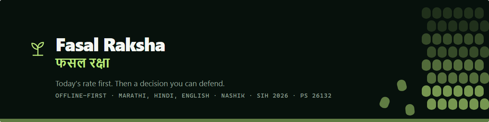
</p>

# 🌾 Fasal Raksha
**Offline-first price intelligence and a verified-buyer marketplace for the field gate**

A farmer standing at the field gate is asked to name a price by someone who
already knows what the mandi paid this morning. Fasal Raksha closes that gap
before the buyer opens his mouth: today's district rate, whether waiting is
worth it, the evidence behind that answer, and which buyer leaves the most
money in the farmer's hand after freight and the risk of being paid late.

> **It does not merely find a buyer. It protects the farmer's decision before the buyer names the price.**

Everything a farmer sees is computed **on their own phone**, from sealed,
hash-verified data bundles. Kill the server mid-session and the prices, the
sell-or-wait answer, the evidence behind it and the ranked buyers all keep
rendering — freshly calculated, not a cached screenshot of yesterday.

Built for **Smart India Hackathon 2026 · PS 26132** — *Strengthening market
linkages and price discovery for farmers* · Government of Maharashtra ·
Maharashtra State Innovation Society.

---

## 📱 What it looks like

Every image below is a capture of the running prototype on a 390×844 phone —
not a mock-up. They are produced by a script that drives the live app
(see [Screenshots](#-screenshots-regenerating-them)).

<table>
  <tr>
    <td width="33%">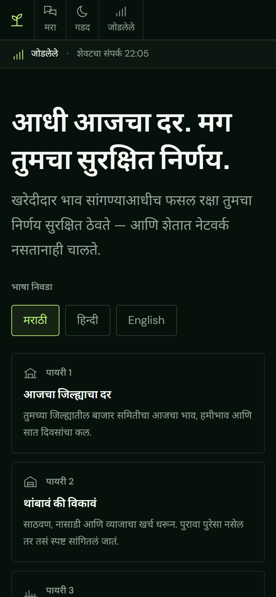</td>
    <td width="33%">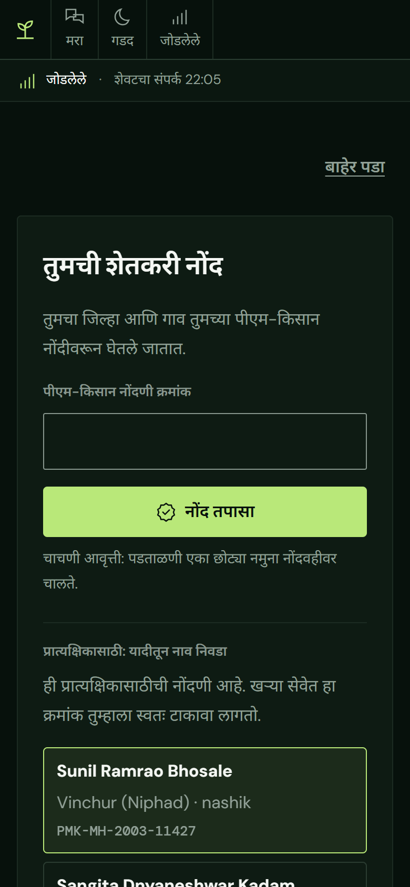</td>
    <td width="33%">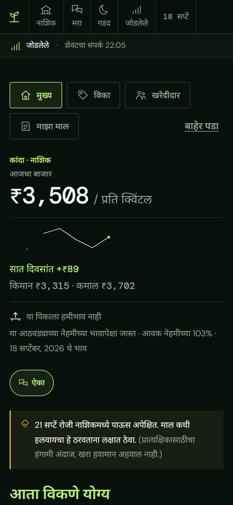</td>
  </tr>
  <tr>
    <td valign="top"><b>Sign in.</b> Phone number, one-time code, language chosen before anything else. Marathi is the default, not an afterthought.</td>
    <td valign="top"><b>Farmer verification.</b> The demonstration registry is listed in full — every farmer with their village, district and land area — and one tap signs you in as that farmer.</td>
    <td valign="top"><b>The morning briefing.</b> The district rate first and largest, with the MSP floor, the seven-day movement drawn by hand, the season's position, and the weather that changes the urgency.</td>
  </tr>
  <tr>
    <td>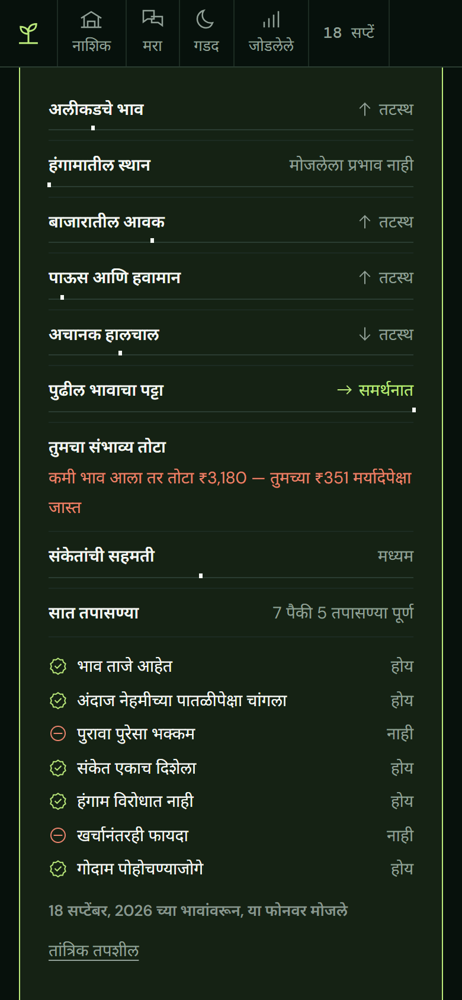</td>
    <td>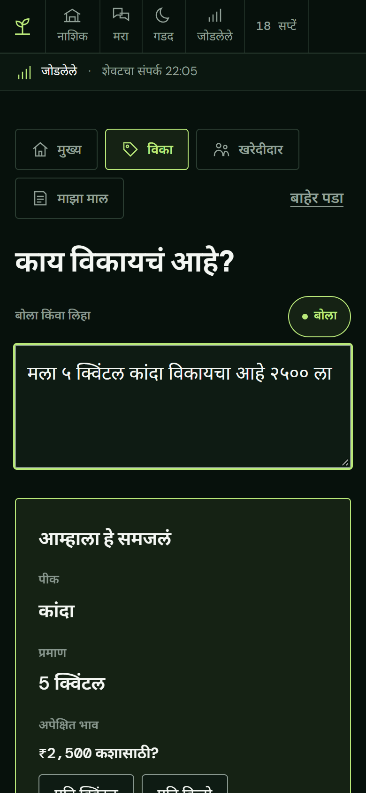</td>
    <td>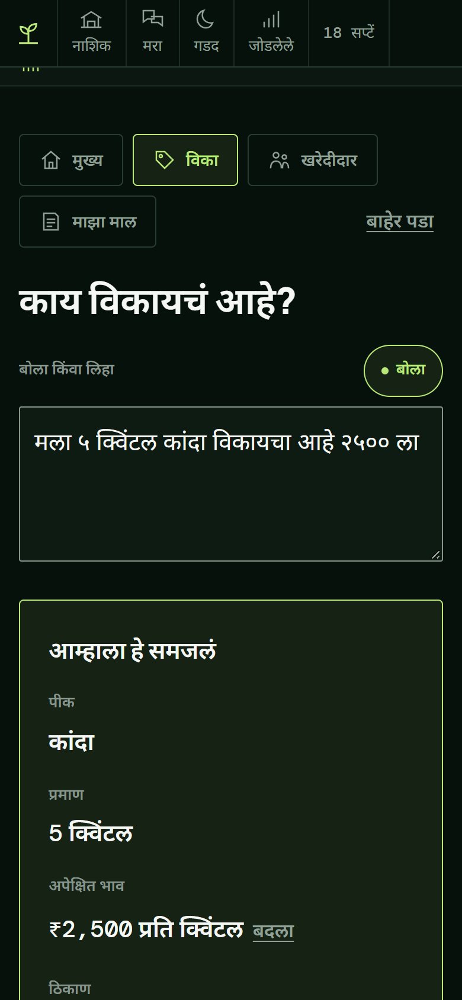</td>
  </tr>
  <tr>
    <td valign="top"><b>"Why this signal?"</b> Nine layers of evidence with their measured weights, the seven conditions that must hold before waiting is ever suggested, and the arithmetic underneath for anyone who wants to check it.</td>
    <td valign="top"><b>₹2,500 — for what?</b> Per quintal, per kilo or for the whole lot differ by two orders of magnitude. The app stops and asks with a single tap rather than guessing and being confidently wrong.</td>
    <td valign="top"><b>Confirm before listing.</b> What the app understood from the sentence — crop, quantity, price, place — shown back in plain words, editable, before anything is published.</td>
  </tr>
  <tr>
    <td>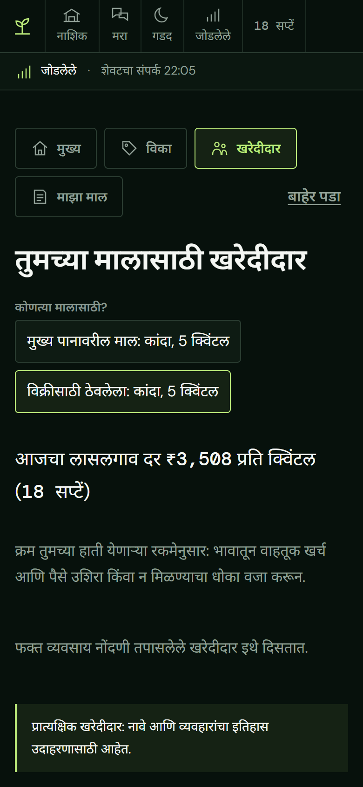</td>
    <td>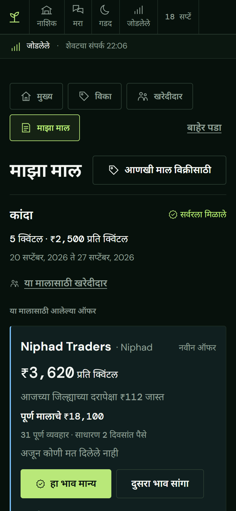</td>
    <td>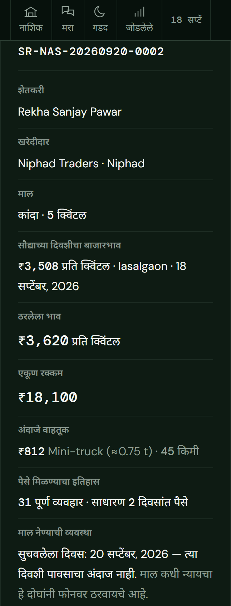</td>
  </tr>
  <tr>
    <td valign="top"><b>The buyers.</b> Ranked by what actually reaches the farmer — the offer, less freight, less the cost of waiting for payment and the chance of not being paid. No match percentages anywhere.</td>
    <td valign="top"><b>Offers and counters.</b> Each offer carries the buyer's completed-deal record, their average payment delay, and what the price means against today's benchmark. Accept, counter or decline.</td>
    <td valign="top"><b>The sauda slip.</b> Issued by the server the moment a price is agreed, with the day's benchmark, the grade and its source, the freight estimate and a suggested pickup day frozen into it. Prints at A5.</td>
  </tr>
  <tr>
    <td></td>
    <td>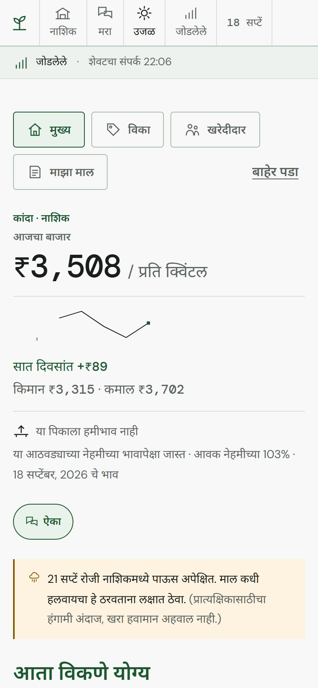</td>
    <td valign="top">
      <b>📴 No network.</b> The product still knows everything it knew: the benchmark, the decision, the evidence, the shortlist — all recomputed on the phone from verified bundles, with the date the data was sealed shown honestly.<br><br>
      <b>☀️ Two themes.</b> NIGHT for a demonstration hall, FIELD for standing in the sun. Same information, different contrast — not a decoration.
    </td>
  </tr>
</table>

<p align="center"></p>

---

## ✨ Features

| Feature | Description |
|---|---|
| 📊 **Today's rate, first** | The district modal price is the largest thing on the screen, with the MSP floor beside it, the seven-day movement, arrivals, and the date the data was sealed |
| 🧭 **Sell or wait** | A nine-layer signal and seven hard conditions produce SELL, WAIT or "not enough to say" — and the product refuses rather than guesses |
| 🔍 **Why this signal** | Every layer, its measured weight, its direction and whether it agrees or disagrees with the verdict; the failed condition is named in a sentence a farmer can act on |
| ⏳ **Staleness cut-off** | Past 7 days for perishables and 14 for grains, the recommendation disappears on its own and the price stays, dated |
| 📴 **Works with no network** | A service worker, an IndexedDB store and an outbox: list a lot standing in a field with no signal; it syncs when the connection returns |
| 🔐 **Sealed data bundles** | Every bundle the phone uses is hash-verified before it is trusted; a tampered bundle is refused, not shown |
| 🗣️ **Speak or type, in three languages** | Marathi, Hindi and English drive the whole interface, the parser and the speech locale — not just the labels |
| ❓ **Ambiguity is asked, not assumed** | "₹2,500" is stopped at the gate: per quintal, per kilo, or for the lot |
| 📸 **On-device grading** | A photograph of the lot is graded on the phone; fourteen failure paths (too dark, blurred, no lot in frame, permission denied…) are each handled, and the farmer always confirms the grade |
| 🏪 **Verified buyers only** | GSTIN/Udyam-verified buyers may offer; unverified accounts cannot |
| 💰 **Net-realisation ranking** | Buyers ranked by what lands in the farmer's hand — offer − freight − the cost and risk of late payment. Never a percentage, never scored against the farmer's own ask |
| 📈 **The district's demand** | What buyers in the district are asking for this week, and at what price, before a farmer decides what to list |
| 🚚 **Consignment pools** | Small lots aggregate to a truckload; the pool clears when the requirement's minimum is met, and each farmer's share is settled by the database, not the client |
| 🤝 **Offer → counter → sauda slip** | A server-authoritative deal state machine: nine states, both parties' actions checked, versioned, and a printable slip frozen at acceptance |
| ✅ **Delivery, payment, ratings** | Both sides confirm delivery and payment; mutual ratings on quality, quantity and availability build a buyer's public record |
| ⚖️ **Disputes with evidence** | Reason-coded disputes with a photograph attached by reference, an officer review path, and grievance patterns by district |
| 🌦️ **Weather as urgency** | Rain in the district shortens the horizon and suggests a pickup day; a storage and e-NWR pledge option appears beside a WAIT verdict |
| 📞 **Beyond the smartphone** | The same engine answers WhatsApp, a 160-character SMS and an IVR script in Marathi — all four channels quote the identical figure |
| 🆔 **Farmer verification** | A PM-KISAN / AgriStack-shaped registry check before a farmer may list, with a demonstration registry of 31 records for one-tap sign-in |
| 🛡️ **Ownership in the database** | Row-level security, not code, decides who may see a row; every request asserts a signed actor for one transaction only |
| 🧪 **Judge Mode** | An unlinked diagnostics screen showing the release actually loaded, every adapter's real mode, the measured layer weights, the pipeline's validation table and this phone's own cache |
| 📱 **Built for the phone in hand** | 390×844 first, 44px touch targets, no horizontal scroll anywhere, both themes, tested at phone size in the browser suite |

---

## 🚀 Getting started

You need **Node 20.11 or newer** (this was built on 24) and **pnpm**. Nothing
else — PostgreSQL is downloaded and run for you, and every external service has
a mock, so there is no account to create and no key to paste.

```bash
pnpm install
pnpm demo
```

Open **https://fasal-raksha.netlify.app/**.

1. Sign in with **any** phone number — the one-time code appears on screen.
2. On the verification screen, **tap any farmer** in the demonstration registry.
   Choose a Nashik one for the onion scenario.
3. The briefing loads. Try **Sell**, speak or type
   `मला ५ क्विंटल कांदा विकायचा आहे २५०० ला`, and answer the price-unit question.

To run everything the build is held to:

```bash
pnpm verify
```

That is typecheck, build, the unit suites, 135 database tests, the ML tests, 24
browser tests and the requirements audit.

Other useful scripts — the traceability table, every requirement and the test
that proves it:

```bash
pnpm requirements
```

The adversarial database suite on its own:

```bash
pnpm test:security
```

Regenerate the forecast bundles from the dataset:

```bash
pnpm ml:pipeline
```

---

## 🔐 Farmer verification — how it works (and its limits)

A farmer must verify a **government-issued Farmer Verification ID** —
PM-KISAN-style, or an 11-digit AgriStack Farmer ID — before they can list a lot.

- The id is checked through the **registry adapter**. A match returns the
  registered name, village, district and land area for confirmation.
- A non-match is refused with a clear explanation, and nothing is created.
- The id is never stored in the clear: only a keyed hash of it reaches the
  database, so the registry cannot be reconstructed from a stolen table.

**Important:** in this build the check runs against a **demonstration registry
bundled in the API** (`apps/api/src/adapters/registry/mock.ts`) — it does
**not** call a real government system. The verification screen lists all 31
records so a reviewer can sign in as any of them with one tap. A few:

```
PMK-MH-2003-11562   Lasalgaon, Nashik
PMK-MH-2003-12004   Pimpalgaon, Nashik
PMK-MH-2003-13102   Chandwad, Nashik
PMK-MH-2211-07314   Ausa, Latur
PMK-MH-1911-04420   Jalgaon
27010203045         AgriStack Farmer ID
```

For production, set `REGISTRY_ADAPTER=live` and point
`REGISTRY_GATEWAY_URL` / `REGISTRY_GATEWAY_KEY` at a backend that holds the
government credential. The browser never sees it, and the API returns only a
verified / not-verified result plus the minimal profile fields. The adapter
interface is identical in both modes, so the swap is configuration.

---

## 🗣️ Voice and language

The whole interface — not only speech — is Marathi, Hindi or English, chosen
before sign-in and changeable at any time. Switching language changes the
labels, the number formatting, the parser's vocabulary and the speech locale
together; a browser test asserts that all three locales agree.

- **Typed or spoken.** A farmer can say *"मला ५ क्विंटल कांदा विकायचा आहे"* or
  type it. Recording is captured on the device and queued in the outbox if the
  network is down.
- **A rule-based parser first.** Crop, quantity, unit, price and place are
  extracted by a deterministic parser in `packages/shared` — no network, no
  key, and the same answer every time. Devanagari numerals, Marathi crop names
  and local units (क्विंटल, किलो, पोते) are all handled.
- **A hosted language model only as a fallback**, server-side, when the rule
  parser cannot read a sentence — off by default, and never on the device.
- **Nothing on a farmer's screen mentions a model.** Not "AI", not "confidence
  interval", not "score" — the words are banned by a test that scans the
  shipped copy.

---

## 🧠 How the sell-or-wait decision works

Nine layers of evidence are combined, each with a weight measured by the
pipeline rather than chosen by hand:

| | Layer | Reads |
|---|---|---|
| RK-1 | Market prices | Recent modal prices in the district |
| RK-2 | Seasonal position | Where today sits against this crop's own climatology |
| RK-3 | Arrivals | Volumes reaching the mandi |
| RK-4 | Weather | Rain and heat that change what waiting costs |
| RK-5 | Unusual moves | Departures large enough to distrust |
| RK-6 | Range ahead | The conformal band around the forecast |
| RK-7 | Your downside | What this particular lot loses if waiting goes wrong |
| RK-8 | Evidence agreement | How much the layers agree with one another |
| RK-9 | The seven checks | Whether every guardrail below passed |

**A WAIT is never shown unless all seven conditions hold.** Any one failing
blocks it, and the farmer is told which:

| | Condition |
|---|---|
| GR-1 | Prices are fresh enough to advise on |
| GR-2 | The expected level beats the usual seasonal one |
| GR-3 | The evidence is strong enough |
| GR-4 | The signals agree |
| GR-5 | The season does not contradict the call |
| GR-6 | The gain covers storage, freight and the cost of waiting |
| GR-7 | Storage is actually within reach |

Onion — the demonstration crop — is exactly where forecasting is hardest, and
a panel is more usefully shown a system that declines to advise than one that
performs.

---

## 💰 How buyer ranking works

Net realisation is the only ordering, and every term of it is on the card:

```
net to farmer  =  offer × quantity
               −  freight (distance × the tariff for that vehicle class)
               −  the cost of waiting for payment (their average delay × the daily cost of money)
               −  the risk-weighted chance of not being paid (from their completed-deal record)
```

- Buyers are compared against the **district modal price**, never against the
  farmer's own asking price.
- **No percentages.** A browser test searches the shipped buyer card for `%`
  and fails if it finds one.
- Every line is checkable — the distance, the tariff, the delay, the record —
  and nothing asks to be trusted.

---

## 📸 How grading works

A photograph of the lot is graded **on the device**, by a model exported to
ONNX and shipped with the bundle. Size, colour and defect share produce a
grade with its reasons written in words.

Fourteen failure paths are each handled, not caught and ignored: permission
denied, no camera, the frame too dark, too bright, blurred, no lot in frame,
the file too large, the upload interrupted, the network gone mid-capture, and
so on. Each gets its own message and its own recovery.

**The farmer always confirms the grade**, and can overrule it. The models are
trained on rendered lots and are marked `fieldValidated: false` everywhere
they appear, including in Judge Mode.

---

## 🤝 From offer to sauda slip

The deal state machine lives in `packages/shared` and is enforced by the
server and by a database trigger — never by the client:

```
LISTED → OFFERED ⇄ COUNTERED → ACCEPTED → SAUDA_SLIP
              → DELIVERY_CONFIRMED → PAYMENT_CONFIRMED → MUTUALLY_RATED
              → DECLINED
              → DISPUTE_OPEN → UNDER_REVIEW → RESOLVED
```

- Only a **verified** buyer may offer; only the counterparty may accept.
- Every transition is versioned: a stale client's write is rejected, not merged.
- The **sauda slip** is frozen at acceptance — the day's benchmark, the agreed
  price, the grade and where it came from, the freight estimate, the suggested
  pickup day — and numbered `SR-NAS-YYYYMMDD-NNNN`.
- Accepting an offer **declines the siblings** and closes the listing, in the
  same transaction.
- A contact grant issues a **masked relay handle**, capped at 20 per buyer per
  day by a database trigger.

---

## 📴 How offline works

| | Behaviour with no network |
|---|---|
| Prices, decision, evidence, buyer shortlist | **Computed on the phone** from the last verified bundle, with its seal date shown |
| Listing a lot, a voice recording, a photograph | **Queued in the outbox**, retried with backoff, drained when the network returns |
| Accepting an offer, confirming delivery or payment | **Refused, and said so.** A deal commits two parties at once; it cannot be decided on one phone |

That last row is a design position, not a gap. It is enforced twice — the
outbox's type cannot express a deal transition, and a browser test with the
network switched off proves the interface says so instead of pretending.

---

## 📞 Beyond the smartphone

The same engine answers three more channels, so a farmer without a smartphone
is not excluded:

- **WhatsApp** — the full briefing in Devanagari.
- **SMS** — one 160-character GSM-7 segment, transliterated:
  `Kanda Lasalgaon Rs3508/qtl · 7d +4% · vikri karava`
- **IVR** — a Marathi script, read in the order a caller can follow.

A test asserts all four surfaces quote the identical figure for the same crop,
district and date. Inbound webhooks are authenticated with a shared secret in
constant time and **fail closed** when it is unset.

---

## 🗂️ Project structure

```
fasal-raksha/
├── packages/shared/       one implementation of every domain rule — zero dependencies,
│   ├── benchmark/         no I/O, no clock, no randomness. The phone, the API and the
│   ├── decision/          channels all compute from this same code, so they cannot drift
│   ├── matching/
│   ├── aggregation/       benchmark · decision · matching · aggregation · dealstate
│   ├── dealstate/         parser · units · vision · weather · channels · bundle · crops
│   └── parser/ units/ vision/ weather/ channels/ bundle/ staleness/ crops/ core/
│
├── apps/api/              Fastify over PostgreSQL 18
│   ├── src/modules/       auth · listings · photos · demand · pools · deals · disputes
│   │                      weather · bundles · channels · outbox · verify · judge · me
│   ├── src/adapters/      market-data · registry · messaging · speech · model-fallback
│   │                      weather · transport-tariff · storage-registry · photos
│   └── test/              contract tests, database tests, the adversarial security suite
│
├── apps/web/              React 18 + Vite PWA
│   ├── src/briefing/      the morning screen and the evidence panel
│   ├── src/sell/          the sentence, the price-unit question, the draft
│   ├── src/camera/        capture, grading, the fourteen failure paths
│   ├── src/match/         the ranked buyers
│   ├── src/pools/         consignments
│   ├── src/deals/         offers, counters, the sauda slip, disputes
│   ├── src/offline/       the service worker, the device store, the outbox
│   ├── src/judge/         Judge Mode
│   ├── src/design/        tokens, glyphs, and the tests that fence the interface
│   ├── src/i18n/          Marathi, Hindi, English
│   └── e2e/               24 browser tests in 17 specs, incl. the 23-step rehearsal
│
├── ml/                    the forecast pipeline (Python)
│   ├── generate/ ingest/ clean/ climatology/ features/ raksha/ evaluate/ export/
│   └── vision/            the grading models and their golden tests
│
├── infra/migrations/      12 ordered, checksummed migrations — immutable once applied
├── tools/                 demo, verify, requirements audit, screenshots, fixtures
└── data/                  the synthetic dataset, the cleaning reports, the sealed bundles
```

---

## 🏗️ Architecture

**One domain layer, three consumers.** `packages/shared` has no dependencies,
no I/O and no clock. The phone imports it, the API imports it, and the SMS
renderer imports it. A price quoted by SMS and a price shown on the phone
cannot disagree, because they are the same function.

**Ownership lives in the database.** Row-level security decides who may read
or write a row. Every request opens a transaction and asserts a **signed
actor** for that transaction only — the signature is verified inside
PostgreSQL, so a forged identity cannot be injected even by a compromised API
process. Aggregates that must cross tenants (a buyer's track record, a pool's
totals, a settlement, a party's ratings) are `SECURITY DEFINER` functions with
a narrow contract, not broad grants.

**The phone computes; the server publishes.** The pipeline seals a bundle per
crop and district, signs it, and publishes a release. The phone verifies the
hash before it trusts a byte, then does every calculation locally. This is why
the app survives the server being killed — and why stale data degrades to a
dated price rather than a confident wrong answer.

**Adapters are switched by configuration, never by code.** Each external
service has a `mock` and a `live` implementation behind one interface. A live
adapter with a missing credential is a **boot-time error** — never a silent
fallback to the mock, and never a screen claiming a connection it does not have.

| Adapter | Live service | Required when live |
|---|---|---|
| `MARKET_ADAPTER` | data.gov.in daily mandi prices | `MARKET_API_KEY` |
| `REGISTRY_ADAPTER` | Farmer registry / eKYC gateway | `REGISTRY_GATEWAY_URL`, `REGISTRY_GATEWAY_KEY` |
| `MESSAGING_ADAPTER` | SMS / WhatsApp gateway | `SMS_GATEWAY_URL`, `SMS_GATEWAY_KEY`, `SMS_TEMPLATE_ID` |
| `SPEECH_ADAPTER` | Bhashini ASR | `BHASHINI_URL`, `BHASHINI_KEY`, `BHASHINI_SERVICE_IDS` |
| `MODEL_FALLBACK_ADAPTER` | Hosted language model, server-side only | `MODEL_FALLBACK_KEY` |
| `STORAGE_ADAPTER` | Warehouse / e-NWR registry | `LOGISTICS_GATEWAY_URL`, `LOGISTICS_GATEWAY_KEY` |
| `TRANSPORT_ADAPTER` | Freight tariffs | `LOGISTICS_GATEWAY_URL`, `LOGISTICS_GATEWAY_KEY` |
| `WEATHER_ADAPTER` | IMD forecast | — |

Photographs are written through the same kind of interface: the demo spools them
to `PHOTO_STORE_DIR` on local disk, and an object store implements the same contract.

**Ten acceptance gates**, all automated, all run by `pnpm verify`:

| | Gate | Proven by |
|---|---|---|
| A | The backend can be killed mid-session and home still renders | The API process is really killed, then the screen is read |
| B | Fourteen adversarial database tests fail to bypass | `pnpm test:security` |
| C | Every one of fourteen camera failure paths is handled | A scripted camera, the real grader, the real upload pipeline |
| D | An old forecast cannot produce a recommendation | The phone's clock moved past the crop's own limit |
| E | Any single failed condition blocks WAIT | Seven independent refusals, and the screen obeying them |
| F | Ranking is explainable, net-realisation ordered, no percentages | The three-buyer scenario, and a search for `%` |
| G | An offline client cannot finalise a deal | A type-level proof, plus IndexedDB read with the network off |
| H | Switching language changes the interface, not just speech | All three locales |
| I | An ambiguous price unit cannot pass silently | The ₹2,500 test |
| J | Every migrated Phase-1 defect has a passing test | The requirements audit |

A **23-step rehearsal** (`apps/web/e2e/rehearsal.spec.ts`) runs on every
verify, twice — once in each theme: language chosen before sign-in, the
benchmark, the evidence panel, a Marathi sentence understood on the phone, the
₹2,500 question, a frame too dark to use, a lot graded on the device, the
ranked buyers, an offer taken, the sauda slip, delivery, payment, the buyer's
record moving, a grade dispute with the photograph — then the network switched
off, everything still computed on the phone, and the outbox draining when it
returns.

---

## 🗄️ Data layers

There are four places data lives, and each one is deliberate.

### 1 · The device — IndexedDB via Dexie, schema v7

Everything needed to work with no network. Versioned migrations, so an
existing install upgrades rather than being wiped.

| Store | Holds |
|---|---|
| `bundles` | Sealed, hash-verified price and forecast bundles, by district and crop |
| `shared` | Reference data used across bundles |
| `manifest` | The release actually loaded, and its seal date |
| `profile` | The signed-in farmer |
| `outbox` | Work waiting for the network, with its state and next-attempt time |
| `events` | A local trail of what happened, for Judge Mode |
| `settings` | Language, theme |
| `listings` | Lots created on this device |
| `recordings` | Voice captures awaiting upload |
| `photos` | Photographs of lots awaiting upload |
| `demand` | The district's buyer demand |
| `pools` | Consignments this farmer's lots are in |
| `deals` | Offers, deals and their sauda slips — readable offline, not changeable |
| `weather` | The district forecast |

### 2 · The system of record — PostgreSQL 18, 12 migrations

Identity, listings, photos, demand, buyer requirements, pools, offers,
counters, deals, sauda slips, contact grants, disputes, grievance evidence and
ratings. Every table carries row-level security policies; aggregates cross
tenants only through `SECURITY DEFINER` functions (`buyer_track_records`,
`pool_totals`, `pool_settle`, `party_ratings`). Migrations are ordered,
checksummed and immutable — an edited migration fails at boot rather than
drifting silently.

### 3 · The sealed bundles — the pipeline's output

Produced by `ml/`, hashed, published as a release, and verified by the phone
before use. The bundle is the contract between the server and the device: the
phone never asks the server what to recommend.

### 4 · The dataset — synthetic, and honest about it

The market data is a synthetic dataset built to the shape of the real feeds,
with every defect of the real ones injected — wrong units, duplicate sessions,
impossible rows, silent gaps — so the cleaner is exercised rather than
flattered. The cleaner's own report is visible in Judge Mode, and **every
screen that shows demonstration data says so**.

---

## 🔍 Judge Mode

<p align="center">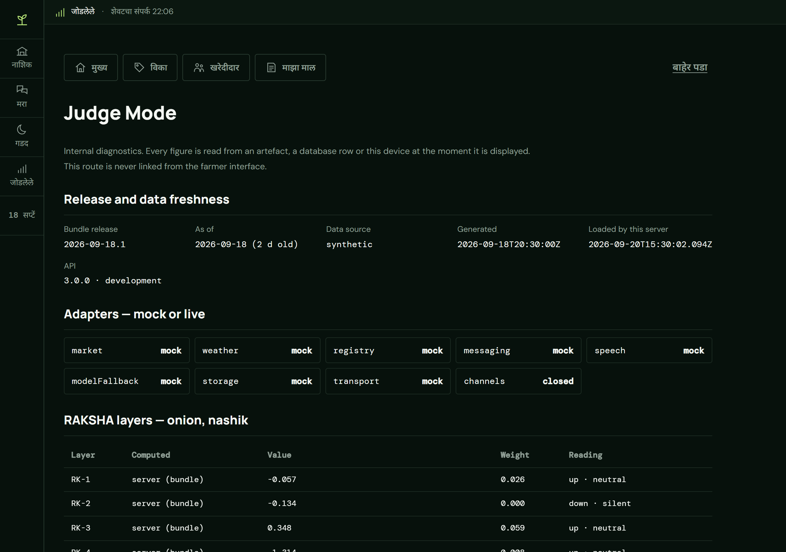</p>

Typed as `#/_judge`, never linked from any farmer screen, lazy-loaded, needing
no session and showing no personal data. It is the one surface written to be
disbelieved: the release actually loaded and its age, every external service
in the mode it is really running in, all nine layers with their measured
weights, the seven conditions, the pipeline's validation table, the ingest
report, the grading models marked `field-validated: false`, this phone's own
cache, and the requirements count. Every figure is read at the moment it is
shown — nothing is typed into the page.

---

## 📸 Screenshots: regenerating them

The images in this README are captures of the running app, not mock-ups:

```bash
node tools/screenshots.mjs --id PMK-MH-2003-12004
```

With `pnpm demo` running, the script signs in as a demonstration farmer, lists
a lot, takes an offer, switches the network off and writes twelve PNGs to
`docs/screens/`. If a screen changes, the screenshot changes with it.

---

## ⚠️ Current limitations

Written down rather than implied.

- **The buyer's own desk is not built.** The demonstration traders act through
  the same API a real buyer would, with the same verification and the same
  state machine, but no buyer signs in through a screen.
- **The FPO and district-officer consoles are not built.** Both are
  first-class accounts in the database with tested endpoints, and no interface
  of their own.
- **The contact relay is issued, not carried.** A masked handle is created
  when a farmer acknowledges an offer; nothing yet routes a call through it.
- **Grading is not field-validated.** The models are trained on rendered lots,
  marked `fieldValidated: false` everywhere, and the farmer always confirms.
- **The registry check reads a demonstration dataset**, not a government
  system (see above).
- **The market data is synthetic**, built to the real feeds' shape.
- **Deals cannot be finalised offline.** Deliberate, and said on screen.
- **No real SMS, WhatsApp or IVR traffic** in the demo — the renderers are
  real and tested; the gateway is mocked.

**Status:** 21 phases built, ten gates green, **75 of 77 requirement rows
done** — the two open ones are the buyer's desk. Run `pnpm requirements` to
print the table.

---

## 🛣️ Suggested next steps for production

1. Move the registry check to the live gateway, with the government credential
   held server-side and farmer consent captured.
2. Build the buyer desk and the FPO / officer consoles on the endpoints that
   already exist and are already tested.
3. Swap the synthetic dataset for the live Agmarknet / MSAMB feeds; the
   cleaner and its report are already written against their real defects.
4. Field-validate the grading models on photographs from real mandis before
   any grade is shown without confirmation.
5. Route the contact relay through a real masked-calling provider.
6. Move photo storage from local disk to an object store — the interface does
   not change.
7. Run field trials in one district before widening. The staleness rules and
   the refusal path are what should be watched first.

---

## 📄 License

[Apache-2.0](LICENSE) · Copyright 2026 Angshuman Bhagat

<p align="center"></p>
